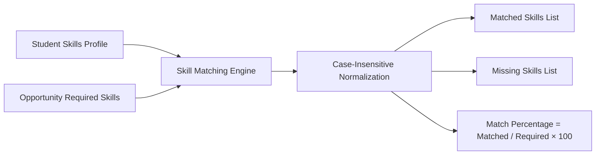
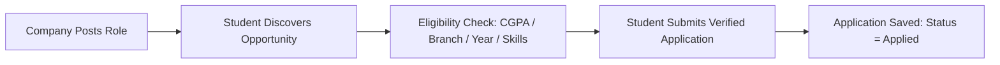
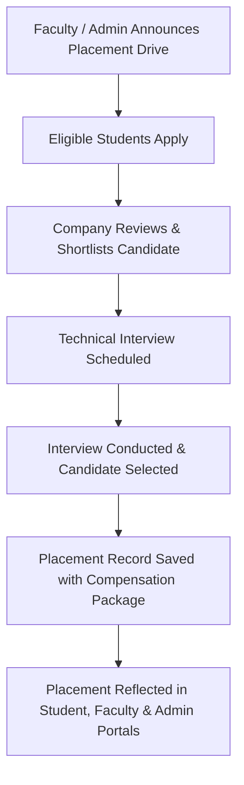

# SkillNexus AI — AI-Driven Micro-Curricular & Dynamic Placement Engine

> **Smart India Hackathon (SIH 2026)**  
> **Team Zenith (SIH26044)**

---

## 1. Project Title
**SkillNexus AI: Intelligent Curriculum Alignment, Skill Gap Analysis & Placement Lifecycle Platform**

---

## 2. Problem Statement
Higher education institutions often experience a disconnect between academic curricula and evolving industry requirements. Students lack visibility into real-time market skill demands, leading to skill gaps, sub-optimal application match rates, and manual, fragmented campus placement operations. Employers struggle to filter and identify job-ready talent aligned with specific role competencies.

---

## 3. Project Objective
SkillNexus AI bridges the academia-industry gap by providing:
- **Intelligent Skill Matching Engine**: Compares student skill profiles against opportunity requirements dynamically using case-insensitive normalization.
- **Skill Gap Roadmaps**: Identifies missing competencies and recommends learning trajectories based on live marketplace demand.
- **End-to-End Recruitment & Placement Pipeline**: Manages the complete lifecycle from placement drive creation, candidate screening, and technical interviews to verified placement offers.
- **Role-Based Portals**: Tailored interfaces and workflows for **Students**, **Corporate Recruiters**, **Institutional Faculty**, and **Platform Administrators**.

---

## 4. Main Features
* **Dynamic Skill Matching**: Calculates percentage compatibility, matched skills, and missing skills for students and recruiters.
* **Skill Gap Analytics**: Pinpoints deficient and beginner-tier skills against target roles with structured roadmaps.
* **Campus Placement Drives**: Configurable drives with real CGPA cutoff, branch eligibility, passing year, and skill prerequisites.
* **Multi-Tenant Candidate Screening**: Companies can review verified candidate resumes, shortlist applicants, and schedule video/on-site interviews.
* **Live Interview Pipeline**: Direct interview coordination with Google Meet/Zoom links, evaluation rounds, and status tracking.
* **Real-Time Notification Feed**: Event-driven alerts for application submissions, reviews, shortlists, interviews, and confirmed placement offers.
* **Light / Dark Mode**: Unified design system powered by CSS variables and persistent theme preference.

---

## 5. User Roles

### A. Student
* Manage verified profile, skills with proficiency ratings, and uploaded resumes.
* Take skill assessments and track verified proficiency badges.
* Analyze skill gaps against target jobs or custom role criteria.
* Discover and apply to open jobs, internships, and campus placement drives.
* Attend scheduled interviews and view official placement offers.

### B. Company / Recruiter
* Maintain verified corporate profile and post job/internship opportunities.
* Search candidates with automated Skill Matching compatibility scores.
* Screen applicants with verified resume PDF viewers.
* Shortlist candidates, schedule interview rounds, and manage virtual meeting links.
* Select candidates and issue official placement offers.

### C. Faculty / Institution
* Monitor student profile completion and academic progress.
* Analyze college-wide skill distributions and institutional skill gap trends.
* Coordinate institutional placement drives and track active candidate pipelines.
* Generate verified placed candidate reports with salary package breakdowns.

### D. Administrator
* Manage platform users, role assignments, and account statuses.
* Review and approve corporate recruiter verification requests.
* Oversee active opportunities, assessments, applications, and placement metrics.

---

## 6. Skill Mapping Flow



1. Retrieve student's skill array from `StudentProfile`.
2. Extract required skill array from target `Opportunity`.
3. Normalize all tokens case-insensitively and remove duplicates.
4. Calculate exact match percentage and identify missing skill gaps.

---

## 7. Internship & Job Flow



1. Recruiter creates job/internship listing with required skills and compensation details.
2. Students view listings with personalized match scores and eligibility badges.
3. System verifies CGPA, branch, and deadline constraints before accepting submissions.
4. Duplicate applications are prevented via compound database constraints.

---

## 8. Placement Flow



---

## 9. Technology Stack

### Frontend
* **Framework**: React 18 with Vite
* **Styling**: Vanilla CSS Variables & Tailwind CSS v4
* **Icons**: Lucide React
* **Routing**: React Router DOM v6
* **Build Tool**: Vite

### Backend
* **Runtime**: Node.js (ES Modules)
* **Framework**: Express.js
* **Database**: MongoDB with Mongoose ODM
* **Authentication**: JSON Web Tokens (JWT) & bcryptjs
* **File Uploads**: Multer (PDF Resumes & Profile Images)
* **Email Service**: Nodemailer (SMTP OTP Delivery)

---

## 10. Project Structure

```
Team_Zenith-SIH26044/
├── backend/
│   ├── src/
│   │   ├── config/          # Database & Cloud Config (db.js)
│   │   ├── controllers/     # Express Route Handlers (auth, student, company, etc.)
│   │   ├── middleware/      # Auth (JWT) & Upload (Multer) Middleware
│   │   ├── models/          # Mongoose Schemas (User, StudentProfile, Opportunity, etc.)
│   │   ├── routes/          # Express API Routers
│   │   ├── utils/           # Skill Matching Engine & Automated Test Suites
│   │   └── index.js         # Backend Server Entry Point
│   ├── package.json
│   └── .gitignore
├── frontend/
│   ├── src/
│   │   ├── components/      # UI Components, Navbar & Dashboard Layouts
│   │   ├── context/         # AuthContext & ThemeContext
│   │   ├── pages/           # Portal Pages (Student, Company, Faculty, Admin)
│   │   ├── App.jsx          # Main Routing & Role Router
│   │   ├── index.css        # Global CSS Design Tokens & Themes
│   │   └── main.jsx         # React DOM Mounting
│   ├── index.html
│   ├── vite.config.js
│   ├── package.json
│   └── .gitignore
├── .gitignore
└── README.md
```

---

## 11. Environment Variables

Create a `.env` file inside the `backend/` directory:

```env
# Server Configuration
PORT=5000
NODE_ENV=development

# MongoDB Connection String
MONGO_URL=mongodb://127.0.0.1:27017/skillnexus_ai
# MONGODB_URI=mongodb+srv://<username>:<password>@cluster.mongodb.net/skillnexus_ai

# JWT Authentication
JWT_SECRET=your_jwt_secret_key_here

# Frontend Client URL (for CORS)
CLIENT_URL=http://localhost:5173
FRONTEND_URL=http://localhost:5173

# Email / SMTP Service (Optional for OTP verification)
SMTP_HOST=smtp.gmail.com
SMTP_PORT=587
SMTP_USER=your_email@gmail.com
SMTP_PASS=your_email_app_password
```

---

## 12. Local Setup Steps

### Prerequisites
* **Node.js**: v18.x or higher
* **npm**: v9.x or higher
* **MongoDB**: Local MongoDB community server (port 27017) or MongoDB Atlas URI

### Step 1: Clone Repository
```bash
git clone https://github.com/Team-Zenith/SkillNexus-AI.git
cd SkillNexus-AI
```

### Step 2: Install Backend Dependencies
```bash
cd backend
npm install
```

### Step 3: Install Frontend Dependencies
```bash
cd ../frontend
npm install
```

---

## 13. Run Backend

From the `backend/` directory:
```bash
npm run dev
```
* Backend starts at `http://localhost:5000`
* Health Check: `http://localhost:5000/api/health`

---

## 14. Run Frontend

From the `frontend/` directory:
```bash
npm run dev
```
* Frontend starts at `http://localhost:5173`
* Vite automatically proxies `/api` requests to the backend.

---

## 15. Database Setup

1. Start your local MongoDB server:
   ```bash
   mongod
   ```
2. The application automatically initializes indexes and verifies database connectivity on startup.
3. If connecting to MongoDB Atlas, set the `MONGO_URL` variable in `backend/.env`.

---

## 16. Authentication Flow

1. **Email / Password Registration**:
   * Users register with role selection (`student`, `company`, `faculty`).
   * Passwords hashed using bcrypt with salt rounds before storage.
2. **Email OTP Verification**:
   * Generates secure 6-digit OTP delivered via SMTP.
   * Auto-expires after 10 minutes via MongoDB TTL index.
3. **JWT Authentication**:
   * Generates signed JWT upon login with 30-day expiration.
   * Protected endpoints require `Authorization: Bearer <token>`.
4. **Role-Based Access Control**:
   * Middleware verifies user role before allowing route execution.

---

## 17. Main API Modules

| Module | Route Prefix | Primary Operations |
| :--- | :--- | :--- |
| **Auth** | `/api/auth` | Login, Register, OTP send/verify, Password Reset |
| **Students** | `/api/students` | Profile, Skills CRUD, Skill Gap Analysis, Notifications |
| **Companies** | `/api/companies` | Profile, Candidate Search, Match Scoring, Interviews |
| **Opportunities** | `/api/opportunities` | Job/Internship CRUD, Placement Drives, Match Query |
| **Applications** | `/api/applications` | Apply, Application Screening, Status Transitions |
| **Institutions** | `/api/institutions` | Faculty Analytics, Institutional Skill Gap, Placements |
| **Admin** | `/api/admin` | User Governance, Verification, Global Metrics |
| **Assessments** | `/api/assessment` | Technical Skill Tests, Score Recording, Question Bank |

---

## 18. Security Features

* **JWT Verification**: Validates token signature and user status on every protected request.
* **Credential Isolation**: Password hashes and OTPs are excluded from default queries (`select: false`).
* **Multi-Tenant Protection**: Enforces corporate ownership validation on candidate applications.
* **Compound Unique Constraints**: Prevents duplicate applications via database compound indexes.
* **CORS Protection**: Whitelists permitted client origins for production and local environments.
* **Input Sanitization**: Validates parameters and trims inputs across all controllers.

---

## License
MIT License. Developed for Smart India Hackathon (SIH 2024).
